# 🦘 VALEK ACADEMY – Výuka a doučování angličtiny hrou
> **Oficiální webová prezentace, CMS systém a rezervační platforma pro akademii angličtiny Josefa Válka v Uherském Hradišti.**

[](https://astro.build/)
[](https://www.typescriptlang.org/)
[](https://tailwindcss.com/)
[](https://tina.io/)
[](https://vercel.com/)
[](https://resend.com/)
[](file:///c:/Users/Jozka/Desktop/ValekAcademy)

🌐 **Živý produkční web:** [valekacademy.cz](https://valekacademy.cz)  
📍 **Doučovna v centru:** Růžová 1238, 686 01 Uherské Hradiště (přímo naproti ZŠ UNESCO)  
📞 **Telefon:** +420 792 372 642 | ✉️ **E-mail:** [info@valekacademy.cz](mailto:info@valekacademy.cz)

---

## 📑 Rychlý rozcestník dokumentace

Pro detailní technické specifikace prozkoumejte specializované příručky v adresáři [`docs/`](file:///c:/Users/Jozka/Desktop/ValekAcademy/docs/):
* 🏛️ [**docs/ARCHITECTURE.md**](file:///c:/Users/Jozka/Desktop/ValekAcademy/docs/ARCHITECTURE.md) – Systémová architektura, SSR + Prerender hybrid, Vercel Serverless, odolnost proti výpadkům.
* 📝 [**docs/CMS_AND_CONTENT_GUIDE.md**](file:///c:/Users/Jozka/Desktop/ValekAcademy/docs/CMS_AND_CONTENT_GUIDE.md) – Správa kolekcí, In-Page Visual Editor, schéma TinaCMS a typová koerce.
* 🎨 [**docs/DESIGN_SYSTEM.md**](file:///c:/Users/Jozka/Desktop/ValekAcademy/docs/DESIGN_SYSTEM.md) – Herní fyzikální estetika, self-hosted fonty, barevné tokeny a fluidní typografie.
* 🚀 [**docs/SEO_AND_PERFORMANCE.md**](file:///c:/Users/Jozka/Desktop/ValekAcademy/docs/SEO_AND_PERFORMANCE.md) – Schema.org JSON-LD graf, Google Image Sitemap, lokální SEO a Core Web Vitals.
* 🤖 [**AGENTS.md**](file:///c:/Users/Jozka/Desktop/ValekAcademy/AGENTS.md) – Závazná pravidla pro vývojáře a AI agenty (CMS-First pravidlo, click-to-edit standard).

---

## 📖 O projektu

**VALEK ACADEMY** představuje moderní, konverzně zaměřený a interaktivní web pro lektora angličtiny Josefa Válka (*Mr. Válek*), který vyrostl a vystudoval v Austrálii (BBA RMIT Melbourne) a přes 25 let žije a vyučuje v České republice. 

Výuka probíhá v útulné doučovně naproti ZŠ UNESCO v Uherském Hradišti v malých skupinkách (4–8 dětí) hravou formou didaktických deskových her (*Karak, Scrabble, Dixit, Dobble, Story Cubes, Carcassonne*) i formou konverzací pro dospělé a přípravy na Scio/přijímací zkoušky.

Web je postaven na hybridní architektuře **Astro v5 + TinaCMS + In-Page Visual Editor**, nabízí bleskurychlý statický rendering (SSG), dynamické API pro rezervace a kompletní editovatelnost veškerého obsahu.

---

## 🏛️ Systémová architektura

```mermaid
flowchart TD
    subgraph Client ["Prohlížeč klienta"]
        UI["Astro Frontend UI"]
        VE["In-Page Visual Editor (dev)"]
        Form["Rezervační formulář (ContactForm)"]
        Calc["Kalkulátor slev & Rozvrh"]
    end

    subgraph Edge ["Vercel Edge & Serverless Platform"]
        AstroSSR["Astro v5 SSR Server (output: 'server')"]
        Prerendered["Statické stránky (/, /cenik, /rozvrh, /galerie, /blog...)"]
        APISave["POST /api/save-content"]
        APISend["POST /api/send-reservation"]
        APIUploadImg["POST /api/upload-image"]
        APIUploadAudio["POST /api/upload-audio"]
        SitemapXML["GET /sitemap.xml (Google Image Sitemap)"]
        TinaIslands["ALL /tina-island/[name]"]
    end

    subgraph CMS ["Správa obsahu & Git"]
        LocalJSON["JSON soubory v content/ (*.json)"]
        TinaCloud["TinaCMS Cloud / GraphQL Engine"]
        GitRepo["GitHub Repozitář (main)"]
    end

    subgraph Services ["Externí integrační služby"]
        Resend["Resend API (@valekacademy.cz e-maily)"]
        Web3Forms["Web3Forms (Záložní failover API)"]
        WhatsApp["WhatsApp Business Deep-link"]
    end

    UI --> AstroSSR
    Prerendered --> UI
    VE -- "Lokální ukládání změn" --> APISave
    VE -- "Upload fotografií (WebP)" --> APIUploadImg
    VE -- "Upload zvukových stop" --> APIUploadAudio
    APISave --> LocalJSON
    APIUploadImg --> LocalJSON
    LocalJSON --> GitRepo

    Form -- "1. Primární odeslání" --> APISend
    APISend --> Resend
    Form -- "2. Automatický fallback při chybě" --> Web3Forms

    Calc --> WhatsApp
    TinaCloud <--> GitRepo
    LocalJSON --> AstroSSR
```



---

## ✨ Klíčové funkce a interaktivní prvky

### 🎯 1. 3krokový rozřazovač skupinek ([`GroupMatcher.astro`](file:///c:/Users/Jozka/Desktop/ValekAcademy/src/components/GroupMatcher.astro))
* **Interaktivní kvíz:** 3 kroky (třída/věk dítěte, herní zájmy, cíle v angličtině).
* **Zvukové efekty Web Audio API:** Generované čistě v prohlížeči přes oscilátory (nulová zátěž externích zvukových souborů).
* **Zlatá VIP vstupenka:** Automatické doporučení vhodné zvířecí skupinky (*Klokánci, Koaly, Vombati, Dingo, Klokani, Krokodýli*) a vygenerování virtuální vstupenky na 1. lekci zdarma s přímým propisem do rezervačního formuláře.

### 💰 2. Interaktivní kalkulátor balíčků & slev ([`PackageCalculator.astro`](file:///c:/Users/Jozka/Desktop/ValekAcademy/src/components/PackageCalculator.astro))
* **Dva nezávislé režimy výuky:** Okamžité přepínání mezi **Děti (1.–6. třída, 60 min)** a **SŠ & dospělí (90 min)**.
* **Nezávislé datové modely:** Oddělená pole `badgeKids` a `badgeTeens` v CMS a dynamické přepínání editačních klíčů ve Visual Editoru.
* **Dynamický matematický výpočet cen:** Ceny balíčků (1 měsíc, 3 měsíce, Pololetí, Celý rok) se automaticky dopočítávají ze zadané základní sazby (`basePrice` a `basePriceTeens`) a slevy balíčku (`baseDiscount`).
* **Kamarádská a sourozenecká sleva (Tandem bonus):** Přepínač extra slevy -5 % pro oba studenty s animovaným zvýrazněním úspory.
* **Rychlá akce:** Předvyplnění formuláře nebo odeslání hotové kalkulace přímo do WhatsAppu lektora.

### 📅 3. Týdenní rozvrh s 2krokovým vyhledávačem ([`ScheduleBlocks.astro`](file:///c:/Users/Jozka/Desktop/ValekAcademy/src/components/ScheduleBlocks.astro))
* **100% řízený z CMS:** Data uložena v [`content/schedule/rozvrh.json`](file:///c:/Users/Jozka/Desktop/ValekAcademy/content/schedule/rozvrh.json).
* **15 zvířecích skupinek:** Pondělí až pátek (12:30 – 18:30) rozdělených podle stupňů ZŠ a SŠ.
* **Automatické kapacitní indikátory:** 🟢 Volno, 🟡 Čekací listina (Waiting list), 🔴 Plně obsazeno, s možností manuálního přepsání (`statusOverride`).
* **Lokální tipy:** Zobrazení docházkové vzdálenosti (např. *📍 Ze ZŠ UNESCO přes přechod 90 vteřin*).
* **Chytrý vyhledávač:** Rychlé filtrování podle ročníku a volných dnů v týdnu.

### 🔊 4. Hlasový přehrávač výslovnosti rodilého mluvčího ([`AudioPreview.astro`](file:///c:/Users/Jozka/Desktop/ValekAcademy/src/components/AudioPreview.astro))
* Reálné nahrávky Josefa Válka ve formátu MP3 uložené v `public/uploads/`.
* Přehrávání autentických frází (*„Welcome!“*, *„Roll the dice!“*, *„Never fear making mistakes!“*, *„Mluvím i česky“*).
* Duální zobrazení anglického originálu a českého překladu s animovaným průběhem přehrávání (progress bar).
* Podpora výměny a nahrávání nových nahrávek přímo přes In-Page Visual Editor.

### 🖼️ 5. Dynamická fotogalerie ([`GalleryView.astro`](file:///c:/Users/Jozka/Desktop/ValekAcademy/src/components/GalleryView.astro))
* Okamžité filtrování kategorií (*Učebna, Deskovky, Výuka, Knihovnička*) bez reloadu stránky.
* Optimalizovaný formát WebP s líným načítáním (`loading="lazy"`).
* Propojení s Google Image Sitemap pro zobrazení fotografií ve vyhledávání Google.

### 📬 6. Rezervační systém s duální odolností ([`ContactForm.astro`](file:///c:/Users/Jozka/Desktop/ValekAcademy/src/components/ContactForm.astro))
* **Automatické formátování telefonu:** Funkce [`formatPhoneCzech()`](file:///c:/Users/Jozka/Desktop/ValekAcademy/src/lib/contactFormUtils.ts) sjednocuje čísla na formát `+420 XXX XXX XXX`.
* **Personalizovaný HTML e-mail přes Resend:** Autoresponder přizpůsobený segmentu (děti, maturanti, Scio příprava, dospělí) s instrukcemi, co si vzít na 1. lekci zdarma.
* **Automatický fallback na Web3Forms:** Pokud serverless funkce selže, požadavek se odešle přes záložní bránu. Žádná poptávka se neztratí.
* **Přidat do Google Kalendáře:** Tlačítko na stránce s poděkováním umožní rodiči uložit si termín do Google Kalendáře na 1 klik.
* **Oslava konverze:** Integrovaná animace konfet (`canvas-confetti`).

### 📚 7. Rádce pro rodiče & Blog ([`/blog`](file:///c:/Users/Jozka/Desktop/ValekAcademy/src/pages/blog/index.astro))
* Samostatné články zaměřené na deskovky, přijímací zkoušky, odstranění strachu z mluvení a psychologii výuky.
* Řízeno přes TinaCMS a soubory v [`content/blog/*.json`](file:///c:/Users/Jozka/Desktop/ValekAcademy/content/blog/).
* Obsahuje strukturovaná data, dobu čtení, tip lektora a konverzní CTA blok.

### 🧭 8. Značková 404 stránka & SEO přesměrování
* **Vlastní chybová stránka:** [`src/pages/404.astro`](file:///c:/Users/Jozka/Desktop/ValekAcademy/src/pages/404.astro) s rychlými odkazy na Rozvrh, Ceník a WhatsApp.
* **SEO alias:** Stránka [`src/pages/rozpis-hodin.astro`](file:///c:/Users/Jozka/Desktop/ValekAcademy/src/pages/rozpis-hodin.astro) a redirect v `astro.config.mjs` automaticky přesměrovávají staré vyhledávací dotazy na `/rozvrh`.

---

## 🛠️ CMS-First & Dvojí editace

Projekt striktně dodržuje pravidlo **žádných hardcoded textů v šablonách**:

```text
content/
├── blog/                  # Články blogu a rádce pro rodiče (.json)
├── gallery/               # Seznam fotografií, popisky a kategorie (gallery.json)
├── legal/                 # Obchodní podmínky (terms.json) a GDPR (privacy.json)
├── pages/                 # Texty a sekce úvodní stránky (home.json)
├── pricing/               # Cenové balíčky, slevy a kalkulátor (cenik.json)
└── schedule/              # Rozvrh, skupinky, dny, časy a kapacity (rozvrh.json)
```

### 1. TinaCMS Administrace (`/admin`)
* Plnohodnotná administrace napojená na Git a Tina Cloud.
* Schéma definováno v [`tina/config.ts`](file:///c:/Users/Jozka/Desktop/ValekAcademy/tina/config.ts).
* Podpora živého náhledu (live preview) přes Tina Islands.

### 2. In-Page Visual Editor (`VisualEditor.astro`)
* Aktivní pouze v lokálním vývoji (`npm run dev`).
* Zlaté plovoucí tlačítko v rohu obrazovky.
* Umožňuje inline přepis textů, výměnu fotografií přes modální okno a nahrávání zvukových nahrávek.
* Změny ukládá přes `/api/save-content` s automatickou typovou koercí hodnot přímo do JSON souborů na disku.

---

## 🔌 Serverless API Endpoints

Všechny API endpointy jsou umístěny v [`src/pages/api/`](file:///c:/Users/Jozka/Desktop/ValekAcademy/src/pages/api/) s nastavením `export const prerender = false;`:

| Endpoint | Metoda | Popis | Zabezpečení |
| :--- | :---: | :--- | :--- |
| **`/api/save-content`** | `POST` | Ukládá editovaný obsah z Visual Editoru do příslušného JSON souboru. Zajišťuje unwrap jmenných prostorů a typovou koerci čísel. | DEV only (`403 Forbidden` v produkci) |
| **`/api/send-reservation`** | `POST` | Zpracuje poptávku, provede validaci e-mailu a telefonu, odešle potvrzení klientovi a notifikaci lektorovi přes Resend API. | Veřejný, validace vstupů a ochrana proti spamu |
| **`/api/upload-image`** | `POST` | Nahraje obrázek, provede EXIF rotaci, zmenší na max 1920 px, zkonvertuje do WebP (85 % kvalita) a uloží do `public/uploads/`. | DEV only (`403 Forbidden` v produkci) |
| **`/api/upload-audio`** | `POST` | Nahraje zvukový soubor (MP3, WAV, OGG, M4A...), zkontroluje velikost (max 25 MB) a uloží do `public/uploads/audio/`. | DEV only (`403 Forbidden` v produkci) |
| **`/sitemap.xml`** | `GET` | Dynamicky generuje kompletní Google Image Sitemap obsahující všechny podstránky, články blogu a snímky fotogalerie. | Veřejný, prerendered při buildu |
| **`/tina-island/[name]`** | `ALL` | Servíruje Tina Island komponenty pro live preview v administrátorském iframe. | TinaCMS bridge |

---

## 🚀 Lokální spuštění (Quickstart)

### Požadavky
* **Node.js** 20+ nebo 22 LTS
* **npm** 10+

### 1. Klonování repozitáře a instalace
```bash
git clone https://github.com/josefmvalek/valek-academy.git
cd valek-academy
npm install
```

### 2. Konfigurace prostředí
Vytvořte soubor `.env` v kořenu projektu:
```bash
cp .env.example .env
```

### 3. Spuštění vývoje
```bash
npm run dev
```
Tento příkaz spustí TinaCMS CLI i Astro vývojový server:
* Webová prezentace: **`http://localhost:4321`**
* TinaCMS administrace: **`http://localhost:4321/admin`**
* TinaCMS lokální GraphQL server: **`http://localhost:4001`**

> **Tip:** Pro rychlý vývoj pouze Astro šablon bez spouštění Tina serveru můžete použít příkaz `npm run dev:astro`.

---

## 🛠️ Dostupné npm skripty

| Příkaz | Popis |
| :--- | :--- |
| **`npm run dev`** | Spustí TinaCMS CLI a Astro vývojový server paralelně |
| **`npm run dev:astro`** | Bleskový start pouze Astro serveru (bez Tina GraphQL) |
| **`npm run build`** | Kompletní produkční build přes [`build.js`](file:///c:/Users/Jozka/Desktop/ValekAcademy/build.js) (Auto-WebP + Tina schema + Astro build) |
| **`npm run build:cloud`** | Tina build napojený na Tina Cloud |
| **`npm run build:local`** | Tina build čistě s lokálním obsahem |
| **`npm run preview`** | Lokální náhled vygenerovaného produkčního buildu |
| **`npm run typecheck`** | Kompletní kontrola TypeScript typů a Astro šablon (**0 errors**) |
| **`npm run optimize:images`** | Jednorázová optimalizace a převod JPG/PNG do WebP přes Sharp |
| **`npm run watch:images`** | Sledování složek `images/` a `uploads/` a automatická konverze nově přidaných fotek |

---

## ⚙️ Přehled proměnných prostředí (.env)

Všechny proměnné prostředí jsou volitelné pro lokální zobrazení webu, ale klíčové pro produkční provoz na **Vercelu**:

| Proměnná | Účel | Kde získat |
| :--- | :--- | :--- |
| `RESEND_API_KEY` | Odesílání e-mailů o rezervaci | [resend.com](https://resend.com) (zdarma 3 000 e-mailů/měsíc) |
| `RESEND_FROM_EMAIL` | Odesílatel zpráv (např. `VALEK ACADEMY <info@valekacademy.cz>`) | Ověřená doména v Resend |
| `RESEND_TO_ADMIN` | E-mail pro zasílání upozornění lektorovi (`info@valekacademy.cz`) | Administrátorský e-mail |
| `PUBLIC_TINA_CLIENT_ID` | Klientské ID projektu v Tina Cloud | [app.tina.io](https://app.tina.io) |
| `TINA_TOKEN` | Read/write token pro Tina Cloud | [app.tina.io](https://app.tina.io) |
| `PUBLIC_WEB3FORMS_KEY` | Klíč pro záložní formulářový fallback | [web3forms.com](https://web3forms.com) (výchozí klíč je zabudován) |

---

## 🔍 Technické SEO & Schema.org

Web disponuje špičkovou SEO výbavou pro vyhledávače Google i Seznam:
* **Schema.org graf:**
  - `@type: ["EducationalOrganization", "LanguageSchool", "LocalBusiness"]` s IČO `72419563`, GPS souřadnicemi `49.0708, 17.4665`, otevírací dobou a výčtem obsluhovaných obcí (*Uherské Hradiště, Kunovice, Staré Město, Babice, Jalubí, Kněžpole, Ostrožská Nová Ves, Uherský Brod*).
  - `@type: "FAQPage"` s dynamickým propisem otázek do rozbalovacích rich snippetů na Googlu.
  - `@type: "Course"` pro kurzy a `@type: "BreadcrumbList"` pro navigaci.
* **Google Image Sitemap:** Generována na [`/sitemap.xml`](https://valekacademy.cz/sitemap.xml) s XML namespace pro obrázky.
* **PWA & Mobile Ready:** Webmanifest [`public/site.webmanifest`](file:///c:/Users/Jozka/Desktop/ValekAcademy/public/site.webmanifest), `apple-touch-icon.png` a meta značka `theme-color` s odstínem `#FAF7F2` pro barevné sladění horní lišty mobilních prohlížečů Safari a Chrome.

---

## 📄 Licence a autorská práva

© 2026 Josef Válek – VALEK ACADEMY. Všechna práva vyhrazena.  
Vytvořeno pro výuku a doučování angličtiny v Uherském Hradišti.
