# 🏛️ Systémová architektura – VALEK ACADEMY

> **Technická dokumentace hybridní architektury webu [valekacademy.cz](https://valekacademy.cz).**  
> Spojení rychlosti statického webu, serverless API Astro v5 na Vercelu, Git-backed TinaCMS a In-Page Visual Editoru s duální odolností.

---

## 🧭 Přehled architektury

Web **VALEK ACADEMY** kombinuje moderní JAMstack s dynamickými serverless funkcemi:

```mermaid
flowchart TD
    subgraph Client ["Klient (Prohlížeč)"]
        UI["Astro Frontend UI"]
        VE["In-Page Visual Editor (dev)"]
        Form["Rezervační formulář (ContactForm)"]
        Calc["Kalkulátor slev & Rozvrh"]
    end

    subgraph Hosting ["Vercel Edge & Serverless Platform"]
        AstroSSR["Astro v5 SSR Server (output: 'server')"]
        Prerendered["Prerendered Pages (/, /cenik, /rozvrh, /blog...)"]
        APISave["POST /api/save-content"]
        APISend["POST /api/send-reservation"]
        APIUploadImg["POST /api/upload-image"]
        APIUploadAudio["POST /api/upload-audio"]
        SitemapXML["GET /sitemap.xml (prerender: true)"]
        TinaIslands["ALL /tina-island/[name]"]
    end

    subgraph DataLayer ["Git-Backed CMS & Obsah"]
        LocalJSON["JSON soubory v content/ (*.json)"]
        TinaCloud["TinaCMS Cloud / GraphQL Engine"]
        GitRepo["GitHub Repozitář (main)"]
    end

    subgraph ThirdParty ["Externí služby"]
        Resend["Resend API (E-maily domény @valekacademy.cz)"]
        Web3Forms["Web3Forms API (Automatický záložní fallback)"]
        GoogleMaps["Google Maps (Růžová 1238, UH)"]
        WhatsApp["WhatsApp API (Přímá komunikace s lektorem)"]
    end

    UI --> AstroSSR
    Prerendered --> UI
    VE -- "Lokální ukládání (DEV)" --> APISave
    VE -- "Nahrávání médií (DEV)" --> APIUploadImg
    VE -- "Nahrávání zvuku (DEV)" --> APIUploadAudio
    APISave --> LocalJSON
    APIUploadImg --> LocalJSON
    LocalJSON --> GitRepo

    Form -- "1. Primární požadavek" --> APISend
    APISend --> Resend
    Form -- "2. Automatický fallback při chybě" --> Web3Forms

    Calc --> WhatsApp
    TinaCloud <--> GitRepo
    LocalJSON --> AstroSSR
```



---

## ⚡ Hybridní model vykreslování (SSR + Prerender)

V konfiguraci [`astro.config.mjs`](file:///c:/Users/Jozka/Desktop/ValekAcademy/astro.config.mjs) je nastaveno:
```javascript
export default defineConfig({
  site: 'https://valekacademy.cz',
  output: 'server',
  adapter: vercel(),
  // ...
});
```

### Proč `output: 'server'` s `prerender = true`?
1. **Bleskový statický výkon:** Veřejné stránky ([`src/pages/index.astro`](file:///c:/Users/Jozka/Desktop/ValekAcademy/src/pages/index.astro), [`src/pages/cenik.astro`](file:///c:/Users/Jozka/Desktop/ValekAcademy/src/pages/cenik.astro), [`src/pages/rozvrh.astro`](file:///c:/Users/Jozka/Desktop/ValekAcademy/src/pages/rozvrh.astro), [`src/pages/galerie.astro`](file:///c:/Users/Jozka/Desktop/ValekAcademy/src/pages/galerie.astro), [`src/pages/sitemap.xml.ts`](file:///c:/Users/Jozka/Desktop/ValekAcademy/src/pages/sitemap.xml.ts)) mají deklarováno `export const prerender = true;`. Jsou vygenerovány v čase sestavení (SSG) a servírovány z Vercel Edge CDN s nulovou latencí a maximálním skóre Google Lighthouse (100/100).
2. **Serverless API pro dynamické akce:** Endpoints v [`src/pages/api/`](file:///c:/Users/Jozka/Desktop/ValekAcademy/src/pages/api/) a [`src/pages/tina-island/[name].ts`](file:///c:/Users/Jozka/Desktop/ValekAcademy/src/pages/tina-island/%5Bname%5D.ts) mají nastaveno `export const prerender = false;`, což Astro zkompiluje do samostatných Vercel Serverless Functions.

---

## 🛡️ Architektura vysoké dostupnosti a odolnosti (Fault Tolerance)

Web má zabudované mechanismy pro stoprocentní kontinuitu provozu:

### 1. Duální doručování poptávek (Resend + Web3Forms)
Ve formuláři [`ContactForm.astro`](file:///c:/Users/Jozka/Desktop/ValekAcademy/src/components/ContactForm.astro):
- **Krok 1 (Primární):** Formulář odešle JSON na interní endpoint `/api/send-reservation`. Ten přes [Resend SDK](https://resend.com) rozešle:
  - Luxusně formátovaný HTML e-mail klientovi (s instrukcemi, co si vzít na 1. lekci zdarma, personifikovaný podle věku dítěte/dospělého).
  - Okamžitou notifikaci lektorovi s kontakty a vybraným slotem.
- **Krok 2 (Automatický fallback):** Pokud `/api/send-reservation` vrátí chybu (např. výpadek sítě, nedostupný API klíč nebo limit kvóty), skript v prohlížeči **automaticky a transparentně** přepne na záložní odeslání přes Web3Forms API. Rodič nikdy neuvidí technickou chybu a poptávka se neztratí.

### 2. Bezpečné načítání dat (TinaCMS vs. Lokální JSON)
V [`src/lib/data.ts`](file:///c:/Users/Jozka/Desktop/ValekAcademy/src/lib/data.ts):
- Všechny dotazy (`getHomePageDataQuery`, `getSchedulePageDataQuery` atd.) jsou obaleny v blocích `try/catch`.
- Pokud GraphQL server TinaCMS neběží (např. při rychlém lokálním běhu `npm run dev:astro` nebo při buildovacím procesu), systém automaticky načte data přímo z lokálních souborů `content/**/*.json`. Web tak lze kompletně spustit a vybuildovat i zcela offline.

### 3. Vercel Build Safeguard (`build.js`)
V souboru [`build.js`](file:///c:/Users/Jozka/Desktop/ValekAcademy/build.js):
- Před samotným buildem se automaticky spustí `scanAndConvertAll()` pro konverzi nových obrázků do formátu WebP.
- TinaCMS build se spouští s přepínačem `--skip-cloud-checks`. Tím je zajištěno, že případné zpoždění indexace na cloudových serverech Tina nikdy nezablokuje produkční nasazení na Vercelu.

---

## 🏝️ TinaCMS Experimental Islands

Pro plynulou vizuální editaci přímo v administrátorském rozhraní TinaCMS (`/admin`) projekt využívá balíček `@tinacms/astro/experimental`:
- Soubor [`src/lib/islands.ts`](file:///c:/Users/Jozka/Desktop/ValekAcademy/src/lib/islands.ts) definuje registr ostrovů pro `page`, `gallery`, `cenik`, `rozvrh`, `privacy`, `terms` a `blog`.
- Endpoint [`src/pages/tina-island/[name].ts`](file:///c:/Users/Jozka/Desktop/ValekAcademy/src/pages/tina-island/%5Bname%5D.ts) dynamicky servíruje konkrétní komponentu s daty propojenými na TinaCMS iframe bridge.
- V produkčním buildu mimo `/admin` se ostrovy vykreslují jako čistý statický HTML kód bez jakéhokoliv klientského TinaCMS JavaScriptu.

---

## 🔒 Bezpečnostní model (Security & Environment Isolation)

1. **Izolace vývojových endpointů:**
   - [`/api/save-content`](file:///c:/Users/Jozka/Desktop/ValekAcademy/src/pages/api/save-content.ts), [`/api/upload-image`](file:///c:/Users/Jozka/Desktop/ValekAcademy/src/pages/api/upload-image.ts) a [`/api/upload-audio`](file:///c:/Users/Jozka/Desktop/ValekAcademy/src/pages/api/upload-audio.ts) obsahují striktní kontrolu:
     ```typescript
     if (!import.meta.env.DEV) {
       return new Response(JSON.stringify({ 
         success: false, 
         error: 'Tento endpoint je dostupný pouze v lokálním vývojovém prostředí.' 
       }), { status: 403 });
     }
     ```
   - V produkci je In-Page Visual Editor kompletně odstraněn z DOMu (`{import.meta.env.DEV && <VisualEditor />}`) a API vrací 403 Forbidden.
2. **Validace a sanitizace:**
   - Telefonní čísla se sanitizují na číslice a kontroluje se délka (min. 9 číslic).
   - E-maily se ověřují regulárním výrazem.
   - Nahrávaná média podléhají kontrole MIME typu a maximální velikosti (10 MB obrázky, 25 MB audio). Názvy souborů jsou normalizovány a zbaveny diakritiky a speciálních znaků.
3. **Ochrana proti XSS v RichTextu:**
   - Pomocná funkce [`formatRichText()`](file:///c:/Users/Jozka/Desktop/ValekAcademy/src/lib/richText.ts) striktně odstraňuje tagy `<script>`, `<iframe>` a inline handlery `on*`.
